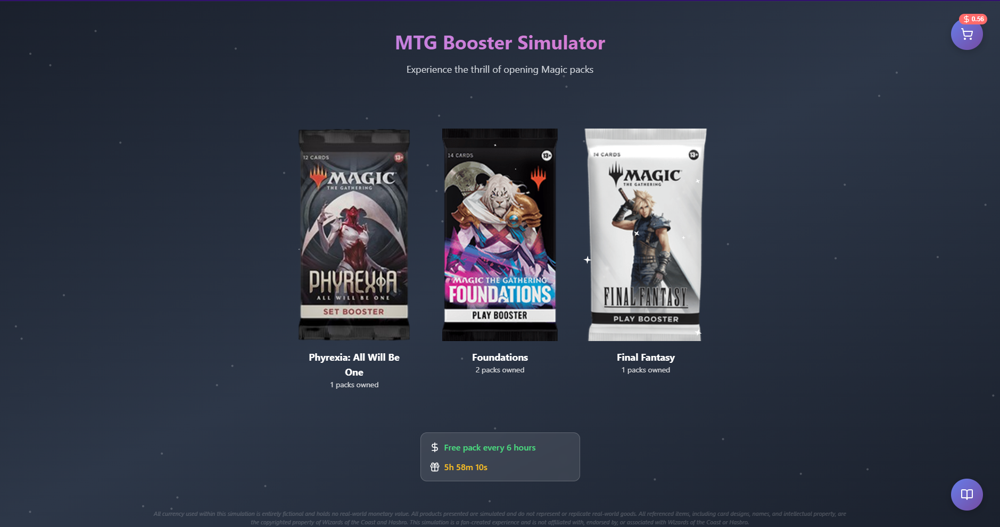

# MTG Booster Pack Simulator

https://julynx.github.io/mtg_booster_simulator

*Virtual MTG Booster Pack Simulator built in React - Experience realistic card opening animations and collect virtual Magic: The Gathering cards!*

## Homescreen and Store

 

  

 

  

 

When you enter the website for the first time, you'll receive $20 of virtual currency to purchase simulated booster packs from the Store. You'll receive a free virtual pack every 6 hours from that moment, no need to be online to claim it.

## Pack Opening Screen

 

  

 

Click on a virtual booster pack to open it, and enjoy the realistic simulation experience with rich animations and sound effects. Cards will glow depending on their rarity when you hover over them, and flip as you click them. Foil cards come to life with flowing waves of color.

## Collection and Overview

 

  

 

  

 

All the virtual cards you've opened are stored in the Collection tab. You can sort and filter them, click to preview them and check their simulated price, and sell them to buy more virtual packs.

## Disclaimer

*This is a virtual MTG Booster Pack Simulator game. All currency used within this simulation is entirely fictional and holds no real-world monetary value. All products presented are simulated and do not represent or replicate real-world goods. All referenced items, including card designs, names, and intellectual property, are the copyrighted property of Wizards of the Coast and Hasbro. This simulation is a fan-created experience and is not affiliated with, endorsed by, or associated with Wizards of the Coast or Hasbro.*
